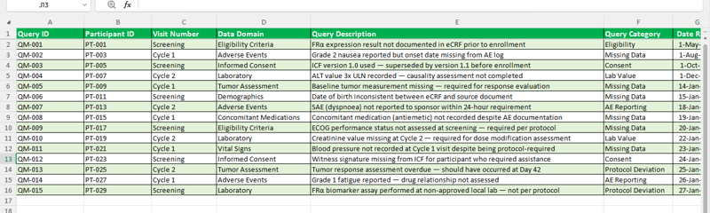

## Mock Clinical Data Query Management Document
A simulated clinical data query-management workflow demonstrating how data discrepancies can be documented, tracked, prioritised, and monitored during clinical data review.

## Project at a Glance
Project Type: Independent clinical data portfolio project
Role: Clinical Data Analyst
Study Context: Phase III ovarian cancer clinical trial
Study Reference: NCT06890338
Primary Focus: Clinical data queries and issue tracking
Output: Mock Query Management Document
Tools: Microsoft Word, Excel
Data: Simulated query records based on publicly available study information

## The Problem
Clinical data review can identify discrepancies that require clarification or correction before study data can be considered ready for analysis.

A structured query-management process helps clinical data teams document these issues consistently, monitor outstanding queries, track resolution, and identify items that may require escalation.
This project demonstrates a simplified query-management workflow using simulated clinical data issues.

## What I Built
I created a mock query-management document containing simulated clinical data queries based on the context of a Phase III ovarian cancer clinical trial.

The document demonstrates how individual data issues can be:
- Documented
- Categorised
- Assigned a status
- Prioritised
- Tracked over time
- Monitored for resolution
- Escalated when appropriate

The project was designed to simulate the type of structured documentation that can support clinical data review workflows.

## Query Management Workflow
The workflow follows:

Identify discrepancy → Document query → Classify issue → Assign priority → Track status → Follow up → Resolve or escalate

# Query Identification
Potential discrepancies were identified from the clinical trial context and translated into realistic mock data queries.

# Query Documentation
Each query was structured with information needed to understand the issue and support follow-up.

# Query Tracking
The tracker was designed to monitor query status and how long issues remained open.

# Escalation
Queries requiring additional attention could be identified using priority and status information.

## Portfolio Evidence
Selected screenshots from the query-management workbook are displayed below.

### Query Tracker and Summary

### Reference Sheet

## Query Fields
The mock tracker includes fields such as:
- Query ID
- Subject / Record reference
- Site
- Data field or issue area
- Query description
- Query category
- Priority
- Date opened
- Status
- Days open
- Resolution / response
- Escalation or follow-up information

# Query Categories
The simulated queries cover examples of clinical data issues such as:
- Missing data
- Inconsistent data
- Date discrepancies
- Safety-related information
- Eligibility-related information
- Treatment information
- Assessment discrepancies
- Other data clarification requirements

# Query Status
Queries were tracked through statuses such as:

Open → Awaiting Response → Resolved
This provides a simple view of outstanding versus completed data-cleaning work.

# Priority and Escalation
Priority was used to distinguish queries that may require different levels of attention.

Examples include:
- Routine data clarification
- Higher-priority data discrepancy
- Safety-related issue requiring timely attention
- Issue requiring escalation or follow-up

Priority does not represent a clinical or regulatory determination. It is used within this portfolio simulation to demonstrate query-management logic.

# Query Aging
The tracker includes a Days Open concept to demonstrate how long unresolved queries have remained outstanding.
Query aging can help data teams identify issues that may require follow-up and monitor the overall query-resolution process.

Full Project Document
The complete mock query-management document is available below.

"View the Full Query Management Document" (NCT06890338_Query_Management_Report.pdf)

## Real-World Relevance
Query management is an important part of clinical data review.

A structured query process helps teams document discrepancies consistently, communicate questions to the appropriate study personnel, monitor outstanding issues, and support timely data cleaning.
This project demonstrates practical understanding of:

 Data discrepancy → Query → Follow-up → Resolution → Data quality

## Skills Demonstrated
- Clinical data review
- Query management
- Data discrepancy identification
- Data-quality monitoring
- Query prioritisation
- Query status tracking
- Issue escalation
- Clinical trial documentation
- Excel-based tracking
- Technical and scientific writing
- GCP-informed clinical research thinking

## Limitations
This is an independent portfolio simulation.
The query records are mock examples and do not represent actual sponsor queries, patient records, or real study-site communications.
The project does not use confidential patient information or proprietary clinical trial data.
The workflow is simplified compared with production EDC and clinical data-management systems.

## Future Improvements
Future versions could include:
- Automated query generation
- EDC-style query workflows
- Query ageing dashboards
- Automated escalation rules
- Power BI visualisation
- Query-resolution metrics
- Integration with clinical data-quality dashboards
- Audit-trail functionality

## Project Outcome
This project demonstrates my ability to translate clinical data-quality issues into structured queries and manage those issues through a documented workflow.

It also demonstrates how clinical research knowledge can be combined with data-quality thinking and operational documentation to support clinical data-management activities.
